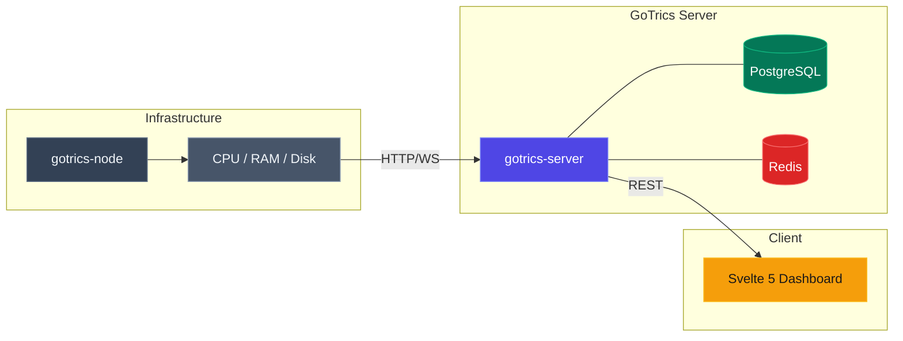

# ⚡ GoTrics Server (ARCHIVED) V2 Soon with different architecture

THIS REPOSITORY HAS BEEN ARCHIVED

> A self-hosted, lightweight infrastructure monitoring solution designed for simplicity.


<div align="center">

| **[🖥️ GoTrics Server](https://github.com/MathDesigns/gotrics-server)** | **[🕵️‍♂️ GoTrics Node](https://github.com/MathDesigns/gotrics-node)** | **[📊 GoTrics Front](https://github.com/MathDesigns/gotrics-front)** |
| :---: | :---: | :---: |
| The Brain (Backend) | The Agent (Collector) | The Dashboard (UI) |

</div>

## 🧐 Why GoTrics?
Most monitoring solutions (Prometheus/Grafana) are heavy and complex to set up. **GoTrics** solves this by offering:
* **Zero-Config Agents:** Just run the binary, point it to the server, and you're done.
* **Low Footprint:** Written in Go to consume minimal resources.
* **Real-Time:** Sub-second metric updates via WebSockets.

## 🏗 Architecture

### Installation

1. Clone the repository:

```bash
git clone https://github.com/MathDesigns/gotrics-server.git
cd gotrics-server
```

2. Install dependencies
```bash
go mod tidy
```

2. Run the server
```bash
go run main.go
```
Runs on port ``8080`` by default

## License
This project is licensed under the MIT License.
